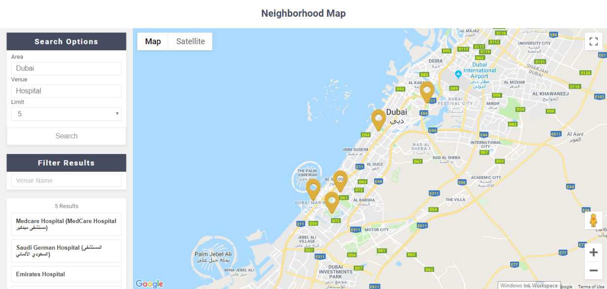
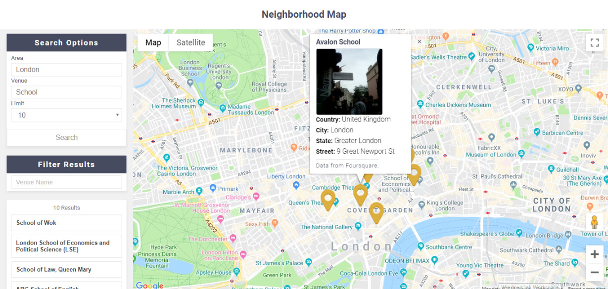
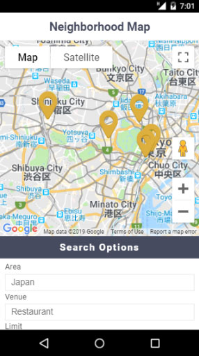

# Neighborhood Map - Udacity

This is a project for the Udacity Front-End Nanodegree called **Neighborhood Map**.

## Description


A single page application featuring a Google map that is populated with venues from Foursquare.

This application allow you to search for venues in various areas of the world using the Foursquare API, then you can filter the list of venues by name.

The project emphasizes using React to build the application and using APIs (Google maps with Foursquare) to populate the app with information.







### Built With

- Javascript (Programming Language)

    - [React](https://reactjs.org/) (A JavaScript library for building UI)

        - google-maps-react, react-dom, react-scripts, prop-types

- [Cmder](https://cmder.net/) (console emulator for Windows)

    - [create-react-app](https://github.com/facebookincubator/create-react-app) (React project scaffolding manager)

    - [git](https://git-scm.com/downloads) (Version control system)

    - [npm](https://nodejs.org/en/download/) (Javascript package manager)

- [VSCode](https://code.visualstudio.com/) (Free. Open source code editor)

- HTML5/CSS3 (Markup/Styling languages)

### What You're Getting

```bash
├── CONTRIBUTING.md
├── README.md - This file.
├── package.json # npm package manager file. It's unlikely that you'll need to modify this.
├── public
│   ├── favicon.ico # App Icon, You may change if you wish.
│   ├── spinner.svg # Spinner svg.
│   ├── no-image.png # Missing image thumbnail.
│   ├── marker-icon.png # Marker Icon.
│   └── index.html # DO NOT MODIFY
└── src
    ├── App.css # Styles for your app. Feel free to customize this as you desire.
    ├── App.js # This is the root of your app. Contains static HTML right now.
    ├── App.test.js # Used for testing. Provided with Create React App. Testing is encouraged, but not required.
    ├── api
    │   ├── Foursquare.js # # A JavaScript API for Foursquare. Instructions for the methods are below
    ├── components # The building blocks of the app
    │   ├── FilterOptions.js # A functional component filters the list of venues
    │   ├── GoogleError.js # A functional component displays an error message
    │   ├── MapContainer.js # A class component that holds the map logic
    │   ├── SearchOptions.js #  A class component that holds the search logic
    │   ├── SideMenu.js # A class component representing the sidemenu
    │   ├── Venue.js # A functional component that displays a venue on the venues list
    │   ├── VenuesList.js # A class component that displays the list of venues
    │   └── Spinner.js # A functional component that displays the loader when needed
    ├── serviceWorker.js # A service worker for offline use
    ├── index.css # Global styles. You probably won't need to change anything here.
    └── index.js # You should not need to modify this file. It is used for DOM rendering only.
```

### Foursquare API

The provided file [`Foursquare.js`](src/api/Foursquare.js) contains the methods you will need to perform necessary operations to contanct the API:

* [`getVenues`](#getvenues)
* [`getVenuePhoto`](#getvenuephoto)

#### `getvenues`

Method Signature:

```js
getVenues(area, venue, limit)
```
* area: `<String>` containing a country, city or area name to search in
* venue: `<String>` containing a name of a venue to search for
* limit: `<number>` containing a number to limit the venues search results
* Returns a Promise which resolves to a JSON object containing a collection of venue objects.

#### `getvenuephoto`

Method Signature:

```js
getVenuePhoto(venueId)
```

* venueId: `<string>` containing the id of the venue to search photos for
* Returns a Promise which resolves to a JSON object containing the photo data of the venue

## Usage

You can run the app locally.

If you want to run locally you have to download the app first:

### Method 1:

1. Click on the green `Clone or download` button above.

2. Click on `Download ZIP`.

3. Extract downloaded Zip file.

4. Install all project dependencies with `npm install`.

5. Run server with `npm start`.

6. With your server running, visit the site: `http://localhost:3000`.

### Method 2:

1. If you have git installed you can clone this repo to your desktop by running this command line:
`git clone https://github.com/Al-Yasa/Neighborhood-Map-Udacity.git`

2. Install all project dependencies with `npm install`.

3. Run server with `npm start`.

4. With your server running, visit the site: `http://localhost:3000`.

## Available Scripts

In the project directory, you can run:

### `npm start`

Runs the app in the development mode.<br>
Open [http://localhost:3000](http://localhost:3000) to view it in the browser.

The page will reload if you make edits.<br>
You will also see any lint errors in the console.

### `npm test`

Launches the test runner in the interactive watch mode.<br>
See the section about [running tests](https://facebook.github.io/create-react-app/docs/running-tests) for more information.

### `npm run build`

Builds the app for production to the `build` folder.<br>
It correctly bundles React in production mode and optimizes the build for the best performance.

The build is minified and the filenames include the hashes.<br>
Your app is ready to be deployed!

See the section about [deployment](https://facebook.github.io/create-react-app/docs/deployment) for more information.

### `npm run eject`

**Note: this is a one-way operation. Once you `eject`, you can’t go back!**

If you aren’t satisfied with the build tool and configuration choices, you can `eject` at any time. This command will remove the single build dependency from your project.

Instead, it will copy all the configuration files and the transitive dependencies (Webpack, Babel, ESLint, etc) right into your project so you have full control over them. All of the commands except `eject` will still work, but they will point to the copied scripts so you can tweak them. At this point you’re on your own.

You don’t have to ever use `eject`. The curated feature set is suitable for small and middle deployments, and you shouldn’t feel obligated to use this feature. However we understand that this tool wouldn’t be useful if you couldn’t customize it when you are ready for it.

## Learn More

You can learn more in the [Create React App documentation](https://facebook.github.io/create-react-app/docs/getting-started).

To learn React, check out the [React documentation](https://reactjs.org/).

### Code Splitting

This section has moved here: https://facebook.github.io/create-react-app/docs/code-splitting

### Analyzing the Bundle Size

This section has moved here: https://facebook.github.io/create-react-app/docs/analyzing-the-bundle-size

### Making a Progressive Web App

This section has moved here: https://facebook.github.io/create-react-app/docs/making-a-progressive-web-app

### Advanced Configuration

This section has moved here: https://facebook.github.io/create-react-app/docs/advanced-configuration

### Deployment

This section has moved here: https://facebook.github.io/create-react-app/docs/deployment

### `npm run build` fails to minify

This section has moved here: https://facebook.github.io/create-react-app/docs/troubleshooting#npm-run-build-fails-to-minify
